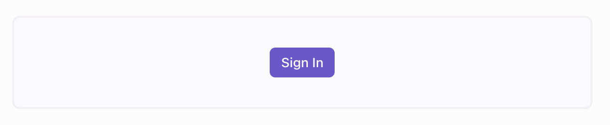
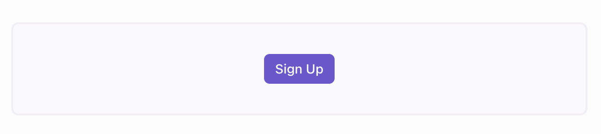
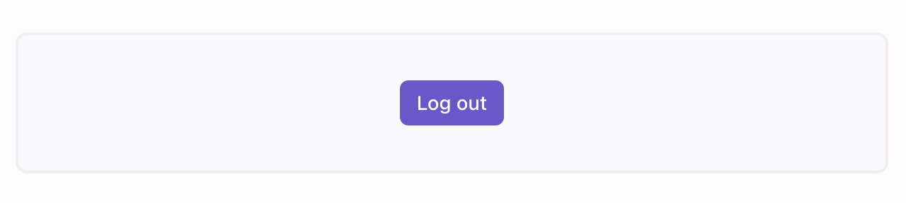

# UI Components

## Buttons

### &lt;SignInButton /&gt;

!!! quote ""
    

    ```python
    import reflex_clerk as clerk
    import reflex as rx
    
    clerk.sign_in_button(
        rx.button("Sign In")
    )
    ```

::: reflex_clerk.sign_in_button
    handler: python
    options:
        show_root_heading: true
        separate_signature: true
        heading_level: 4


### &lt;SignUpButton /&gt;

!!! quote ""
    
    
    ```python
    import reflex_clerk as clerk
    import reflex as rx
    
    clerk.sign_up_button(
        rx.button("Sign Up")
    )
    ```

::: reflex_clerk.sign_up_button
    handler: python
    options:
        show_root_heading: true
        separate_signature: true
        heading_level: 4

### &lt;SignOutButton /&gt;

!!! quote ""
    

    ```python
    import reflex_clerk as clerk
    import reflex as rx
    
    clerk.sign_out_button(
        rx.button("Sign Out")
    )
    ```

::: reflex_clerk.sign_out_button
    handler: python
    options:
        show_root_heading: true
        separate_signature: true
        heading_level: 4

### &lt;UserButton /&gt;

!!! quote ""
    

    ```python
    import reflex_clerk as clerk

    clerk.user_button()
    ```


::: reflex_clerk.user_button
    handler: python
    options:
        show_root_heading: true
        separate_signature: true
        heading_level: 4

## Authentication Components


### &lt;SignIn /&gt;

!!! quote ""
    
    
    ```python
    import reflex_clerk as clerk

    clerk.sign_in()
    ```    

::: reflex_clerk.sign_in
    handler: python
    options:
        separate_signature: true
        heading_level: 4


### &lt;SignUp /&gt;

!!! quote ""
    
    
    ```python
    import reflex_clerk as clerk

    clerk.sign_up()
    ```    

::: reflex_clerk.sign_up
    handler: python
    options:
        separate_signature: true
        heading_level: 4

### &lt;UserProfile /&gt;

!!! quote ""
    
    
    ```python
    import reflex_clerk as clerk

    clerk.user_profile()
    ```    

::: reflex_clerk.user_profile
    handler: python
    options:
        show_root_heading: true
        separate_signature: true
        heading_level: 4


